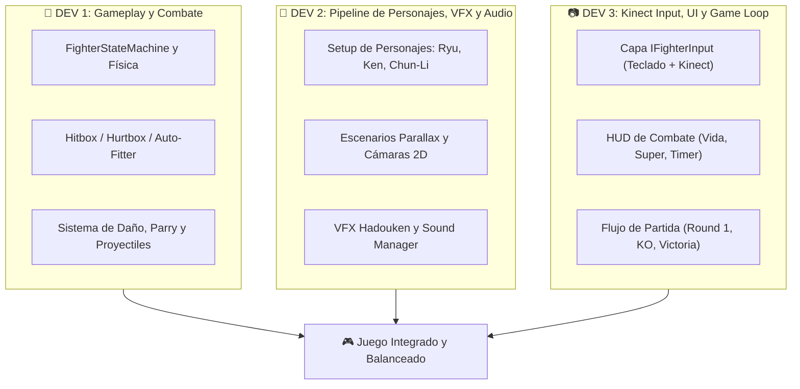

# 📅 Plan de Desarrollo Maestro y Calendario de Sprints (3 Desarrolladores)
## Proyecto: Street Fighter III: 3rd Strike (Unity + Kinect)
**Fecha de Inicio:** 5 de Septiembre de 2026  
**Fecha de Entrega Final:** 1 de Diciembre de 2026 (~12 Semanas)  
**Alcance de Personajes:** Ryu, Ken, Chun-Li + 2 Escenarios (Japón / China)

---

### 👥 Distribución de Roles en el Equipo

Para evitar que los 3 se pisen los pies en Git o dependan unos de otros para avanzar, el trabajo se divide por **módulos independientes y desacoplados**:



---

### ⏱️ Cronograma de 6 Sprints (Ciclos de 2 Semanas)

```
[Sprint 1: Sep 5 - Sep 19]  --> Core Motor 2D y Ryu Básico
[Sprint 2: Sep 20 - Oct 3]  --> Combate Completo (Daño, Hurtboxes, Parry, Hadouken)
[Sprint 3: Oct 4 - Oct 17]  --> Ken y Chun-Li Integrados + Escenarios
[Sprint 4: Oct 18 - Oct 31] --> Kinect Gestures e Input Pipeline
[Sprint 5: Nov 1 - Nov 14]  --> Game Loop (Rounds, KO, Selección de Personajes)
[Sprint 6: Nov 15 - Nov 30] --> Pulido, Calibración de Latencia y Demo Final
[🎯 DICIEMBRE 1]             --> ENTREGA FINAL DEL PROYECTO
```

---

### 📋 Detalle de Tareas por Sprint

#### 📌 SPRINT 1 (Sep 5 - Sep 19): Fundamentos del Motor 2D y Ryu
* **Objetivo del Sprint:** Ryu moviéndose fluidamente en el escenario con máquina de estados y cámara funcional.
* **Tareas Dev 1 (Gameplay):**
  - Implementar la máquina de estados desacoplada (`FighterStateMachine.cs` y `FighterPhysics.cs`).
  - Movimiento en suelo (walk forward/backward, crouch, dash) y salto parabólico con física.
* **Tareas Dev 2 (Pipeline de Arte):**
  - Auto-poblar `Ryu_Animator.controller` con todas las animaciones.
  - Montar el escenario de Japón (Suzaku Castle) con capas de `ParallaxBackground.cs` y Sorting Layers.
* **Tareas Dev 3 (Input y UI Base):**
  - Diseñar la interfaz `IFighterInput.cs` y el adaptador de teclado (`KeyboardFighterInput.cs`).
  - Configurar la cámara dinámica de 2 luchadores (Cinemachine o script de seguimiento y distancia).
* **Entregable Sprint 1:** Demo jugable donde controlas a Ryu caminando, saltando y agachándose en el escenario de Japón.

---

#### 📌 SPRINT 2 (Sep 20 - Oct 3): Detección de Impactos y Combate Real
* **Objetivo del Sprint:** Ryu puede golpear a un muñeco de entrenamiento (Dummy), hacer Hadouken, Parry y recibir daño.
* **Tareas Dev 1 (Gameplay):**
  - Implementar `FighterHurtbox` y `FighterHitbox` con el script de auto-ajuste de cajas por sprite (`SF3AutoHurtboxFitter.cs`).
  - Lógica de impacto: Hitstun (aturdimiento), Blockstun (bloqueo) y ventana de Parry (0.2s).
* **Tareas Dev 2 (Arte y Audio):**
  - Prefab de Proyectil Hadouken con collider y animación de impacto.
  - Prefabs de efectos de partículas/sprites: chispa de golpe, destello azul de Parry, polvo al aterrizar.
  - Integrar `SF3SoundManager` con voces y golpes de Ryu.
* **Tareas Dev 3 (Input y UI):**
  - Implementar el buffer de comandos (detección de cuartos de círculo `236P` para Hadouken y `623P` para Shoryuken en teclado).
  - Barra de vida temporal en pantalla que disminuye al recibir golpes.
* **Entregable Sprint 2:** Ryu peleando contra un Dummy, lanzando Hadoukens con sonido y efectos visuales, con barras de vida reactivas.

---

#### 📌 SPRINT 3 (Oct 4 - Oct 17): Expansión de Personajes (Ken y Chun-Li)
* **Objetivo del Sprint:** Los 3 personajes (Ryu, Ken, Chun-Li) completamente jugables y diferenciados.
* **Tareas Dev 1 (Gameplay):**
  - Ajustar frame data y propiedades de los ataques únicos de Ken (Shoryuken ígneo) y Chun-Li (Hyakuretsukyaku / Patadas rápidas, Kikoken).
  - Implementar los agarres normales (`throw_forward`, `throw_backward`).
* **Tareas Dev 2 (Arte y Audio):**
  - Generar y auto-poblar los Animators de Ken (`01_Ken`) y Chun-Li (`03_ChunLi`).
  - Montar el segundo escenario: China (Crowded Street) con Parallax.
  - Asignar bancos de audio de voz y SFX para Ken y Chun-Li.
* **Tareas Dev 3 (Input y UI):**
  - Adaptador de Input para 2 Jugadores (Player 1 en teclado izquierdo / Player 2 en teclado derecho/mando).
  - Sistema de cambio de lado (*Cross-up / Flip visual*) cuando un jugador salta por encima del otro.
* **Entregable Sprint 3:** Partida local 1v1 entre cualquiera de los 3 personajes (Ryu vs Ken, Ryu vs Chun-Li) en 2 escenarios diferentes.

---

#### 📌 SPRINT 4 (Oct 18 - Oct 31): Integración del Sensor Kinect / Visión por Computadora
* **Objetivo del Sprint:** Control corporal en vivo reemplazando o complementando el teclado.
* **Tareas Dev 1 (Gameplay):**
  - Calibración de ventanas de tolerancia y tiempos de respuesta para que el combate físico se sienta ágil.
  - Manejo de estados de espera y anti-spam de gestos.
* **Tareas Dev 2 (Arte y Audio):**
  - Super Arts / Súper Movimientos: Animación de fondo negro/destello (*Super Flash*) al ejecutar el movimiento especial.
  - Pantallas de victoria y poses de victoria de los 3 luchadores.
* **Tareas Dev 3 (Input y UI - FOCO KINECT):**
  - Conectar el SDK de Kinect v2 (o MediaPipe Unity Plugin) implementando `KinectFighterInput : IFighterInput`.
  - Mapear gestos corporales:
    * Extensión rápida de brazo -> Puño.
    * Elevación de pierna -> Patada.
    * Agacharse físicamente -> Crouch.
    * Juntar y empujar ambas manos -> Hadouken.
* **Entregable Sprint 4:** Jugador 1 controlando a Ryu con su propio cuerpo frente al sensor Kinect lanzando golpes y Hadoukens.

---

#### 📌 SPRINT 5 (Nov 1 - Nov 14): HUD Arcade, Flujo de Juego y Modos
* **Objetivo del Sprint:** El juego tiene estructura completa de arcade (Selección de Personaje -> Pelea -> KO -> Ganador).
* **Tareas Dev 1 (Gameplay):**
  - Sistema de Rounds: Mejor de 3 rounds, reseteo de posiciones, temporizador de 99 segundos.
  - Lógica de KO, Doble KO, Time Over y Super KO.
* **Tareas Dev 2 (Arte y Audio):**
  - Audio del Announcer oficial de SF3 ("Round 1... Fight!", "You Win!", "Perfect!").
  - Menú de selección de personaje con retratos e iconos animados.
* **Tareas Dev 3 (Input y UI):**
  - HUD Arcade definitivo Pixel-Perfect: Barras de Vida verdes/rojas, Barra de Super Arts (con medidor EX), Contador de victorias.
  - Guía visual en pantalla para el Kinect (muestra silueta o indicador para que el usuario sepa si la cámara lo detecta bien).
* **Entregable Sprint 5:** Ciclo de juego completo de inicio a fin con interfaz pulida, selección de personajes y combate con reglas oficiales.

---

#### 📌 SPRINT 6 (Nov 15 - Nov 30): Pulido, Balance, Pruebas y Ensayo de Entrega
* **Objetivo del Sprint:** Cero errores críticos, latencia mínima en Kinect y demo ensayada.
* **Tareas Dev 1, Dev 2 y Dev 3 (Todo el equipo sincronizado):**
  - **Pruebas de latencia:** Ajustar el umbral de aceleración de las manos en Kinect para que los golpes salgan instantáneos.
  - **Pruebas de estrés y bugs:** Probar colisiones en las esquinas del escenario, combos repetitivos y pausas.
  - **Build final ejecutable:** Crear el ejecutable `.exe` standalone y verificar que corra a 60 FPS estables.
  - **Guía de presentación:** Preparar la demostración para el profesor/jurado (1 persona jugando con Kinect y 1 con teclado o 2 en Kinect).

---

### 🛡️ Reglas Anti-Fracaso para Estudiantes (Mitigación de Riesgos)

1. **La Regla del Teclado Primero:** Todo el combate, personajes y menús DEBEN funcionar al 100% con teclado antes de meter el Kinect. Si el Kinect falla el día de la entrega, el juego sigue siendo un juegazo 100% jugable con mando/teclado.
2. **Arquitectura por Interfaces (`IFighterInput`):** El código de Ryu no sabe si quien le manda la orden es un Kinect, una IA o un teclado. Esto permite que el Dev 1 y Dev 2 avancen sin esperar a que el Dev 3 termine el sensor.
3. **No tocar los Sprites:** No recortar imágenes ni modificar manualmente tamaños de lienzos. Usar las herramientas de 1 clic del menú `SF3 Tools`.
4. **Semana de Contingencia (Exámenes universitarios):** El Sprint 6 tiene carga reducida para que puedan estudiar y rendir exámenes sin atrasar el proyecto.
