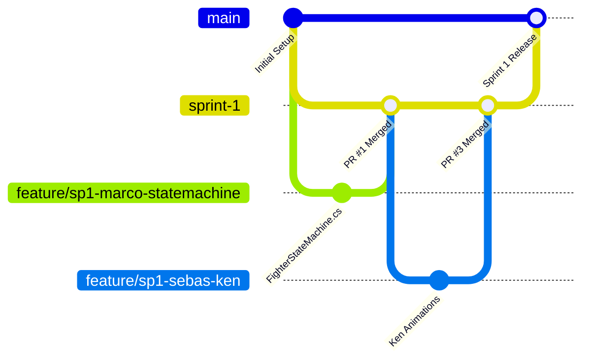

# 📊 Guía de GitHub Projects, Tablero Kanban y Tareas Atómicas
## Street Fighter III: 3rd Strike (Unity + Azure Kinect + IA Adaptativa)

Esta guía explica cómo configurar el **Tablero Kanban en GitHub Projects**, cómo estructurar las tareas atómicas por desarrollador (**Marco, Sebas, Kevin**) y cómo automatizar los estados (**Todo $\rightarrow$ In Progress $\rightarrow$ Review / Lab Tuesday $\rightarrow$ Done**) para que el profesor vea un flujo de trabajo profesional de nivel de la industria.

---

### 1. Estructura de Columnas del Tablero Kanban

En tu repositorio de GitHub, ve a la pestaña **Projects** $\rightarrow$ **New Project** $\rightarrow$ **Board** y crea estas 5 columnas:

```
[📋 1. Product Backlog] ──> [📌 2. Sprint Backlog (Todo)] ──> [⚙️ 3. In Progress] ──> [🔍 4. Lab Tuesday Review] ──> [✅ 5. Done]
```

1. **📋 Product Backlog:** Todas las tareas futuras de los Sprints 2 al 6.
2. **📌 Sprint Backlog (Todo):** Las tareas activas del Sprint actual asignadas a Marco, Sebas y Kevin.
3. **⚙️ In Progress:** La tarea que el desarrollador está programando actualmente (máximo 1 o 2 por persona a la vez).
4. **🔍 Lab Tuesday Review:** Tareas que ya funcionan en teclado (miércoles a lunes) y están listas para la prueba física en el sensor **Azure Kinect** los días martes en la universidad.
5. **✅ Done:** Tareas aprobadas, probadas en el laboratorio e integradas a la rama `main` mediante Pull Request.

---

### 2. Automatizaciones de GitHub Projects (Flujo Automático)

Configura los **Workflows** de tu GitHub Project (icono de tres puntos `...` arriba a la derecha $\rightarrow$ **Workflows**):

* **Item added to project** $\longrightarrow$ Estado: `Product Backlog` o `Sprint Backlog`.
* **When a branch or PR is opened** $\longrightarrow$ Mover automáticamente a `In Progress`.
* **When a PR is labeled with `needs-lab-test`** $\longrightarrow$ Mover a `Lab Tuesday Review`.
* **When a Pull Request is merged into `main`** $\longrightarrow$ Mover automáticamente a `Done`.

> [!TIP]
> **El Truco del Profesor (`Closes #ID`):**  
> Cuando un desarrollador cree un Pull Request o haga el commit de cierre, escriba en la descripción:  
> `Closes #12` (reemplazando `12` por el número de la Issue).  
> Al fusionar (*merge*) el Pull Request, **GitHub cerrará la Issue y moverá la tarjeta a `Done` automáticamente**, sumando puntos directos en las métricas de contribución.

---

### 3. Sistema de Etiquetas (Labels) en GitHub

Crea estas etiquetas en **GitHub $\rightarrow$ Issues $\rightarrow$ Labels**:

| Etiqueta | Color | Uso |
| :--- | :--- | :--- |
| `role:marco` | 🔵 Azul | Tareas de Marco (Lead / Ryu / ML-Agents) |
| `role:sebas` | 🔴 Rojo | Tareas de Sebas (Dev 2 / Ken / VFX & Audio) |
| `role:kevin` | 🟣 Púrpura | Tareas de Kevin (Dev 3 / Chun-Li / Kinect & UI) |
| `sprint:1` a `sprint:6` | 🟡 Amarillo | Identificador del Sprint activo |
| `area:combat` | 🟠 Naranja | Máquina de estados, Hitboxes, Daño |
| `area:kinect` | 🟢 Verde | Azure Kinect SDK, Body Tracking, Gestos 3D |
| `area:ai-ml` | 🩵 Celeste | ML-Agents, PyTorch, ONNX, DDA |
| `needs-lab-test` | 🌸 Rosa | Requiere prueba física de martes en Azure Kinect |

---

### 4. Backlog Desglosado: 36 Tareas Atómicas (6 Sprints)

A continuación tienes las **36 tareas listas para crear en GitHub Issues**, divididas en 6 por Sprint (2 por persona por Sprint):

---

#### 🏃 SPRINT 1 (Sep 5 – Sep 19): Fundamentos del Motor 2D y Ryu
* **#1 [SP1-MARCO] Máquina de Estados Core (`FighterStateMachine.cs` y `FighterPhysics.cs`)**
  * *Assignee:* @Marco | *Labels:* `role:marco`, `sprint:1`, `area:combat`
  * *Criterios:* Desacoplar estados de reposo, caminar, agacharse y salto parabólico con física en Unity sin animador espagueti.
* **#2 [SP1-MARCO] Expansión y calibración de movimientos de Ryu (`02_Ryu`)**
  * *Assignee:* @Marco | *Labels:* `role:marco`, `sprint:1`, `area:combat`
  * *Criterios:* Sincronizar todos los 64 AnimationClips de Ryu en `Ryu_Animator.controller` y verificar retornos a idle.
* **#3 [SP1-SEBAS] Pipeline de Sprites y Animaciones de Ken (`01_Ken`)**
  * *Assignee:* @Sebas | *Labels:* `role:sebas`, `sprint:1`, `area:combat`
  * *Criterios:* Organizar las 7 categorías de Ken, generar AnimationClips con `SF3 Tools` y crear `Ken_Animator.controller`.
* **#4 [SP1-SEBAS] Montaje del Escenario Japón (Suzaku Castle) con Parallax**
  * *Assignee:* @Sebas | *Labels:* `role:sebas`, `sprint:1`, `area:art`
  * *Criterios:* Configurar Sorting Layers, fondo cielo, castillo, suelo y script `ParallaxBackground.cs` a 100 PPU.
* **#5 [SP1-KEVIN] Arquitectura de Entrada `IFighterInput.cs` y Emulador de Teclado**
  * *Assignee:* @Kevin | *Labels:* `role:kevin`, `sprint:1`, `area:kinect`
  * *Criterios:* Crear interfaz `IFighterInput` y script `KeyboardFighterInput` para permitir control offline (miércoles-lunes).
* **#6 [SP1-KEVIN] Configuración Inicial del SDK Azure Kinect en Unity**
  * *Assignee:* @Kevin | *Labels:* `role:kevin`, `sprint:1`, `area:kinect`, `needs-lab-test`
  * *Criterios:* Importar Azure Kinect Body Tracking SDK y verificar lectura de 32 articulaciones en escena de prueba.

---

#### 🏃 SPRINT 2 (Sep 20 – Oct 3): Detección de Impactos y Pipeline Azure Kinect
* **#7 [SP2-MARCO] Sistema de Hitboxes/Hurtboxes y `SF3AutoHurtboxFitter`**
  * *Assignee:* @Marco | *Labels:* `role:marco`, `sprint:2`, `area:combat`
  * *Criterios:* Cajas de 3 piezas (cabeza, torso, piernas) que se auto-ajustan al sprite en saltos y agachadas.
* **#8 [SP2-MARCO] Lógica de Combate: Daño, Hitstun, Blockstun y Ventana de Parry**
  * *Assignee:* @Marco | *Labels:* `role:marco`, `sprint:2`, `area:combat`
  * *Criterios:* Detección de colisiones, cálculo de vida restada, aturdimiento y parry exacto de 0.2s.
* **#9 [SP2-SEBAS] Prefabs de Proyectil Hadouken y Efectos Visuales (VFX)**
  * *Assignee:* @Sebas | *Labels:* `role:sebas`, `sprint:2`, `area:art`
  * *Criterios:* Prefab de bola de energía con collider, chispa de impacto y destello azul de Parry con auto-destrucción.
* **#10 [SP2-SEBAS] Integración de Audio Oficial con `SF3SoundManager`**
  * *Assignee:* @Sebas | *Labels:* `role:sebas`, `sprint:2`, `area:audio`
  * *Criterios:* Sonidos de golpes débiles/fuertes, voces de ataque de Ryu y música de fondo BGM en loop.
* **#11 [SP2-KEVIN] Clasificador Somatosensorial de Gestos 3D (Puñetazo y Bloqueo)**
  * *Assignee:* @Kevin | *Labels:* `role:kevin`, `sprint:2`, `area:kinect`, `needs-lab-test`
  * *Criterios:* Algoritmo de velocidad/extensión de muñeca para puño y posición de brazos cruzados para guardia.
* **#12 [SP2-KEVIN] Cámara Dinámica 2D de Lucha (Cinemachine / Target Group)**
  * *Assignee:* @Kevin | *Labels:* `role:kevin`, `sprint:2`, `area:ui`
  * *Criterios:* Cámara ortográfica que mantiene encuadrados a los dos luchadores con límites de escenario.

---

#### 🏃 SPRINT 3 (Oct 4 – Oct 17): Ken y Chun-Li Integrados + Base de Datos SQLite
* **#13 [SP3-MARCO] Sistema de Grabación de Telemetría (`MatchTelemetryLogger.cs`)**
  * *Assignee:* @Marco | *Labels:* `role:marco`, `sprint:3`, `area:ai-ml`
  * *Criterios:* Registrar en cada frame `[distancia, estado_propio, estado_rival, accion]` para dataset de IA.
* **#14 [SP3-MARCO] Prefab de Dummy de Entrenamiento e Intercambio de Bandos (Cross-up)**
  * *Assignee:* @Marco | *Labels:* `role:marco`, `sprint:3`, `area:combat`
  * *Criterios:* Volteo automático de `Visuals` según la posición X relativa del oponente.
* **#15 [SP3-SEBAS] Setup Completo de Combate de Ken (`01_Ken`)**
  * *Assignee:* @Sebas | *Labels:* `role:sebas`, `sprint:3`, `area:combat`
  * *Criterios:* Configurar Hitboxes/Hurtboxes de Ken, Shoryuken ígneo y voces de Ken en el SoundManager.
* **#16 [SP3-SEBAS] Montaje de Escenario China (Crowded Street) con Parallax**
  * *Assignee:* @Sebas | *Labels:* `role:sebas`, `sprint:3`, `area:art`
  * *Criterios:* Escenario urbano chino con múltiples capas de profundidad y Sorting Layers correctas.
* **#17 [SP3-KEVIN] Setup de Sprites, Animaciones y Combate de Chun-Li (`03_ChunLi`)**
  * *Assignee:* @Kevin | *Labels:* `role:kevin`, `sprint:3`, `area:combat`
  * *Criterios:* Configurar Kikoken, Hyakuretsukyaku (patadas rápidas) y Animator de Chun-Li.
* **#18 [SP3-KEVIN] Módulo de Base de Datos Local SQLite (`DatabaseManager.cs`)**
  * *Assignee:* @Kevin | *Labels:* `role:kevin`, `sprint:3`, `area:database`
  * *Criterios:* Guardar perfiles de usuario, puntuaciones, precisión de gestos Kinect e historial de partidas en `.db`.

---

#### 🏃 SPRINT 4 (Oct 18 – Oct 31): ML-Agents Fase 1 (Imitación) y Gestos Avanzados
* **#19 [SP4-MARCO] Configuración de Unity ML-Agents y Entorno de Aprendizaje**
  * *Assignee:* @Marco | *Labels:* `role:marco`, `sprint:4`, `area:ai-ml`
  * *Criterios:* Instalar ML-Agents Python package, configurar `Agent` de combate con espacios de acción discretos.
* **#20 [SP4-MARCO] Entrenamiento de Behavioral Cloning (BC / GAIL) en GPU RTX 4060**
  * *Assignee:* @Marco | *Labels:* `role:marco`, `sprint:4`, `area:ai-ml`
  * *Criterios:* Entrenar política con dataset humano de telemetría y exportar `AI_Imitation.onnx`.
* **#21 [SP4-SEBAS] Efecto Visual de Super Flash y Cinemática de Súper Ataques**
  * *Assignee:* @Sebas | *Labels:* `role:sebas`, `sprint:4`, `area:art`
  * *Criterios:* Oscurecimiento de fondo temporal y rayo de energía al disparar Super Art (Shinkuu Hadouken / Shinryuken).
* **#22 [SP4-SEBAS] Poses de Victoria e Intros Únicas de Personajes**
  * *Assignee:* @Sebas | *Labels:* `role:sebas`, `sprint:4`, `area:art`
  * *Criterios:* Integrar animaciones de intro rival (Ryu vs Ken) y poses de victoria con frases de audio.
* **#23 [SP4-KEVIN] Mapeo de Gestos de Patada y Agachado en Azure Kinect**
  * *Assignee:* @Kevin | *Labels:* `role:kevin`, `sprint:4`, `area:kinect`, `needs-lab-test`
  * *Criterios:* Detección de elevación de tobillo/rodilla para patada y descenso de centro de masa para agacharse.
* **#24 [SP4-KEVIN] Mapeo del Gesto Somatosensorial de Hadouken (Dos Manos)**
  * *Assignee:* @Kevin | *Labels:* `role:kevin`, `sprint:4`, `area:kinect`, `needs-lab-test`
  * *Criterios:* Detectar unión de ambas muñecas y empuje frontal para disparar el proyectil de energía.

---

#### 🏃 SPRINT 5 (Nov 1 – Nov 14): ML-Agents Fase 2 (Refuerzo + DDA) + HUD Arcade
* **#25 [SP5-MARCO] Entrenamiento por Refuerzo (PPO) de 3 Dificultades (`Easy`, `Med`, `Hard`)**
  * *Assignee:* @Marco | *Labels:* `role:marco`, `sprint:5`, `area:ai-ml`
  * *Criterios:* Recompensas por spacing, castigo de errores y daño; exportar 3 modelos ONNX.
* **#26 [SP5-MARCO] Gestor de Dificultad Dinámica Adaptativa (`AdaptiveAIManager.cs`)**
  * *Assignee:* @Marco | *Labels:* `role:marco`, `sprint:5`, `area:ai-ml`
  * *Criterios:* Evaluar telemetría de la partida en vivo y alternar dinámicamente la política del bot según el rendimiento humano.
* **#27 [SP5-SEBAS] Sistema de Anunciador Oficial de SF3 ("Round 1, Fight, K.O.!")**
  * *Assignee:* @Sebas | *Labels:* `role:sebas`, `sprint:5`, `area:audio`
  * *Criterios:* Coordinar voces del Announcer con banners de texto animados en pantalla.
* **#28 [SP5-SEBAS] Menú de Selección de Personajes Arcade con Retratos**
  * *Assignee:* @Sebas | *Labels:* `role:sebas`, `sprint:5`, `area:ui`
  * *Criterios:* Pantalla de selección interactiva para elegir entre Ryu, Ken y Chun-Li con sonido de confirmación.
* **#29 [SP5-KEVIN] HUD Arcade Completo (Barras de Vida, Super Gauge y Timer de 99s)**
  * *Assignee:* @Kevin | *Labels:* `role:kevin`, `sprint:5`, `area:ui`
  * *Criterios:* Barras de vida reactivas Pixel-Perfect, medidor de super arts y contador de rounds.
* **#30 [SP5-KEVIN] Guía Visual de Silueta Azure Kinect en Pantalla**
  * *Assignee:* @Kevin | *Labels:* `role:kevin`, `sprint:5`, `area:ui`, `needs-lab-test`
  * *Criterios:* Mini indicador en esquina que muestra si el usuario está en el rango óptimo (1.5m a 4m) del sensor.

---

#### 🏃 SPRINT 6 (Nov 15 – Nov 30): Calibración, Pruebas de Estrés y Build Final
* **#31 [SP6-MARCO] Calibración de Latencia y Balance de Frame Data del Bot**
  * *Assignee:* @Marco | *Labels:* `role:marco`, `sprint:6`, `area:combat`
  * *Criterios:* Ajustar tiempos de reacción de la IA para que la experiencia sea justa y fluida.
* **#32 [SP6-MARCO] Auditoría de Integración y Build Standalone `.exe` a 60 FPS**
  * *Assignee:* @Marco | *Labels:* `role:marco`, `sprint:6`, `area:core`
  * *Criterios:* Generar build de producción en Windows 64-bit y auditar consumo de memoria/GPU.
* **#33 [SP6-SEBAS] Pulido de Assets, Shaders de Destello y Balance de Mezcla de Audio**
  * *Assignee:* @Sebas | *Labels:* `role:sebas`, `sprint:6`, `area:art`
  * *Criterios:* Normalizar volúmenes de SFX vs BGM vs Voces y corregir cualquier artefacto visual.
* **#34 [SP6-SEBAS] Documentación y Manual de Usuario / Guía de Demostración**
  * *Assignee:* @Sebas | *Labels:* `role:sebas`, `sprint:6`, `area:docs`
  * *Criterios:* Elaborar la guía de pasos para la presentación ante el jurado/profesor.
* **#35 [SP6-KEVIN] Filtro de Suavizado de Ruido de Articulaciones en Azure Kinect**
  * *Assignee:* @Kevin | *Labels:* `role:kevin`, `sprint:6`, `area:kinect`, `needs-lab-test`
  * *Criterios:* Aplicar filtro exponencial / Moving Average a los nodos 3D para evitar temblores o falsos disparos.
* **#36 [SP6-KEVIN] Pantalla de Estadísticas Finales con Consultas SQLite**
  * *Assignee:* @Kevin | *Labels:* `role:kevin`, `sprint:6`, `area:database`
  * *Criterios:* Mostrar al final del combate: golpes acertados, Hadoukens lanzados, precisión física y ganador.

---

### 5. Guía de Ramas Git (*Git Branching Strategy*)

Para evitar conflictos al trabajar 3 personas en paralelo:



1. **Ramas de Tarea:** Cada desarrollador crea una rama con el nombre de su issue:  
   `feature/sp1-marco-statemachine` o `feature/sp1-kevin-kinect-input`.
2. **Pull Requests:** Al terminar, se abre un PR hacia `sprint-X` o `main` y se añade a los otros dos compañeros como revisores.
3. **Commit Messages Semánticos:**  
   - `feat: implementar saltos parabolicos en FighterPhysics (#1)`
   - `fix: corregir pivote en Shoryuken de Ken (#3)`
   - `docs: actualizar manual de kinect (#6)`
