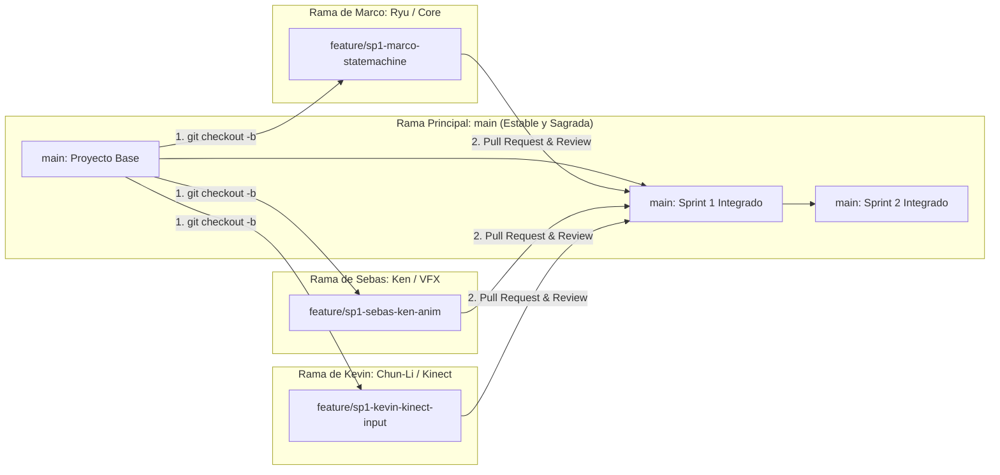
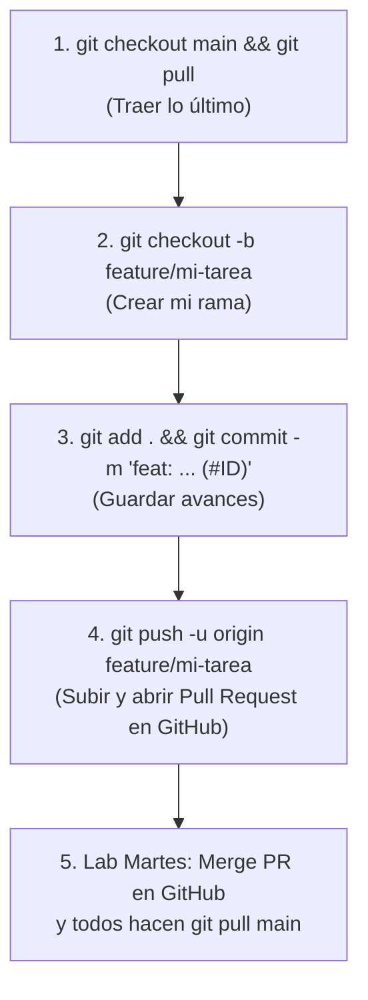

# 🌳 Guía de Git Flow, Ramas y Sincronización del Equipo (3 Desarrolladores)
## Street Fighter III: 3rd Strike (Unity + Azure Kinect + IA Adaptativa)

Esta guía explica el flujo exacto de ramas en Git para que **Marco, Sebas y Kevin** puedan trabajar simultáneamente sin generar conflictos de fusión (*Merge Conflicts*) ni romper las escenas de Unity.

---

### 1. El Flujo de Ramas (Diagrama de Flujo)



---

### 🛡️ 2. Las 2 Reglas de Oro en Unity para Evitar Conflictos

1. **Trabajar en Prefabs Separados:**
   * Marco edita `Fighter_Ryu.prefab`.
   * Sebas edita `Fighter_Ken.prefab`.
   * Kevin edita `Fighter_ChunLi.prefab`.
   * *Resultado:* Como son archivos distintos, Git **nunca generará conflictos**.

2. **Escenas Personales de Prueba (Sandbox):**
   * `Assets/.../Scenes/Sandbox_Marco.unity`
   * `Assets/.../Scenes/Sandbox_Sebas.unity`
   * `Assets/.../Scenes/Sandbox_Kevin.unity`
   * Cada uno prueba libremente en su propia escena. La escena oficial de combate (`Main_Fight_Stage.unity`) solo se toca los **martes en el laboratorio**.

---

### 🔄 3. El Ciclo de 5 Pasos para Cada Tarea



#### Paso 1: Actualizar `main` local antes de empezar
```bash
git checkout main
git pull origin main
```

#### Paso 2: Crear tu rama para la Issue activa
```bash
# Ejemplo Marco (Issue #1):
git checkout -b feature/sp1-marco-statemachine

# Ejemplo Sebas (Issue #3):
git checkout -b feature/sp1-sebas-ken-anim

# Ejemplo Kevin (Issue #5):
git checkout -b feature/sp1-kevin-chunli-anim
```

#### Paso 3: Guardar cambios y hacer commit
```bash
git add .
git commit -m "feat: implementar animaciones de Ken (#3)"
```

#### Paso 4: Subir a GitHub y abrir Pull Request
```bash
git push -u origin feature/sp1-sebas-ken-anim
```
En la web de GitHub, dale a **Compare & pull request** y pon en la descripción: `Closes #3`.

#### Paso 5: Merge los martes en el laboratorio
Al hacer clic en **Merge pull request** en GitHub, la Issue se cierra y la tarjeta se mueve sola a **`Done`**. Luego, en tu PC ejecutas:
```bash
git checkout main
git pull origin main
```
